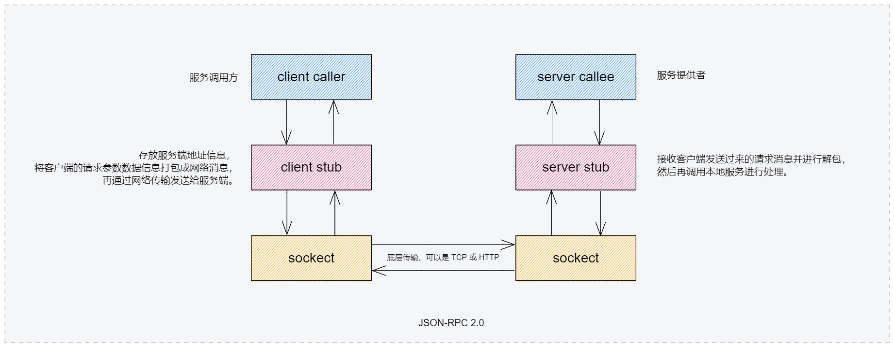

# json-rpc 2.0

JSON-RPC是一个无状态且轻量级的远程过程调用(RPC)协议。 本规范主要定义了一些数据结构及其相关的处理规则。它允许运行在基于socket,http等诸多不同消息传输环境的同一进程中。

# 实现

## 服务端

| 名称 | 协议  | 描述 |
|---|---|---|
| TCP服务端| text | 使用 workerman 基于text协议
| HTTP服务端| http | 使用 workerman 基于http协议

## 客户端

| 名称 | 模式  | 描述 |
|---|---|---|
| TCP客户端 | 同步 | 使用 php-http/socket-client 组件
| TCP客户端 | 异步 | 使用 react/socket 组件
| HTTP客户端 | 同步 | 使用 yurunsoft/yurun-http 组件
| HTTP客户端 | 异步 | 使用 workerman/http-client 组件
